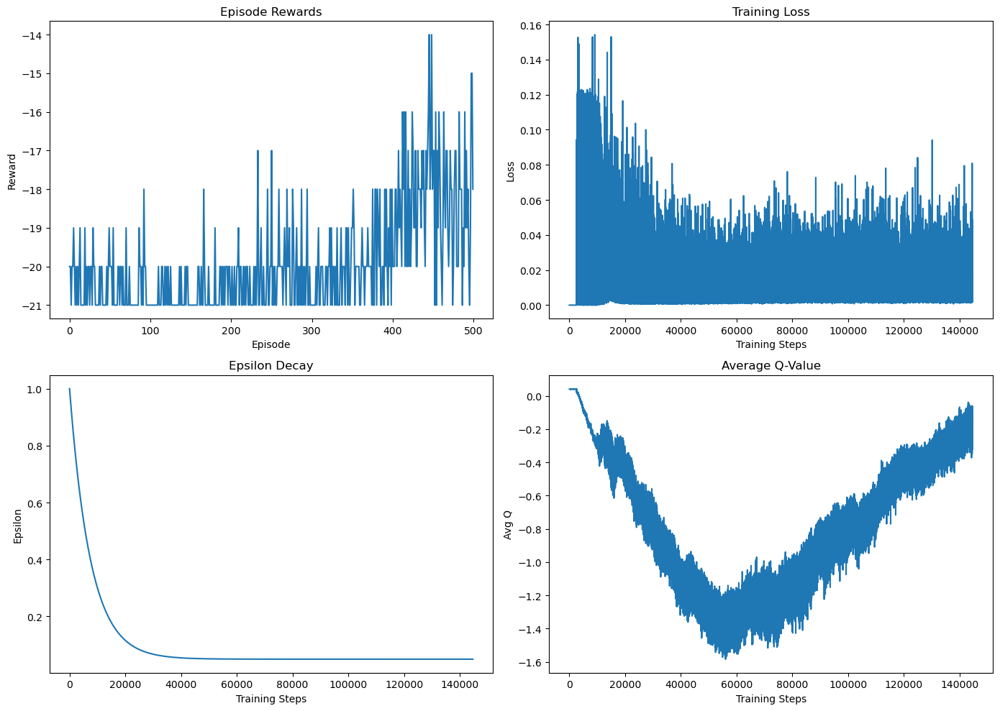
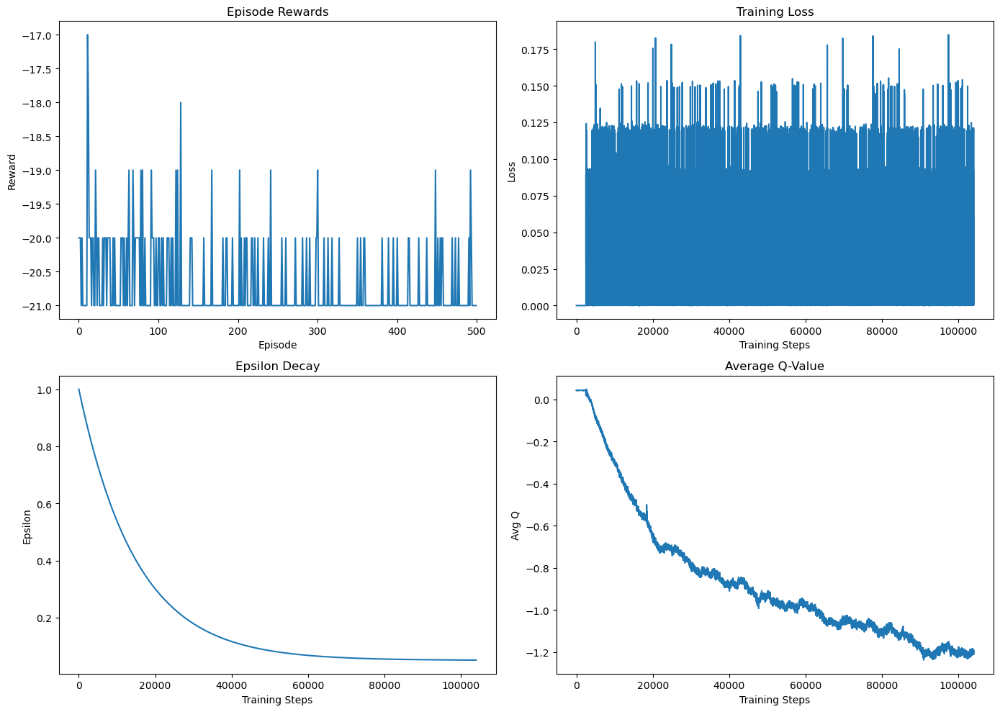
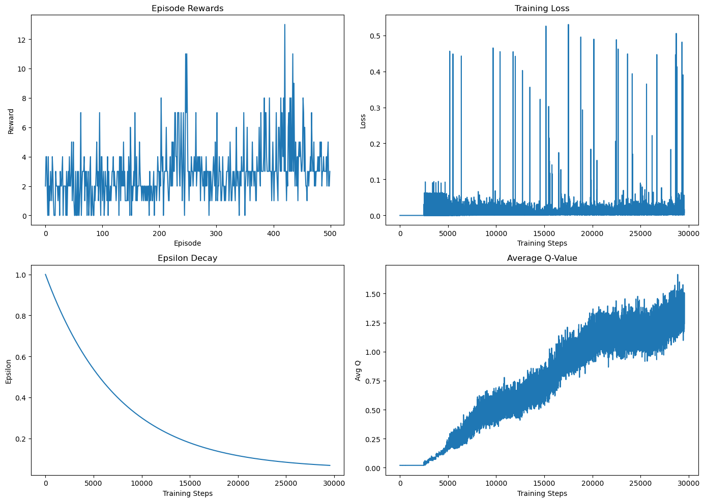
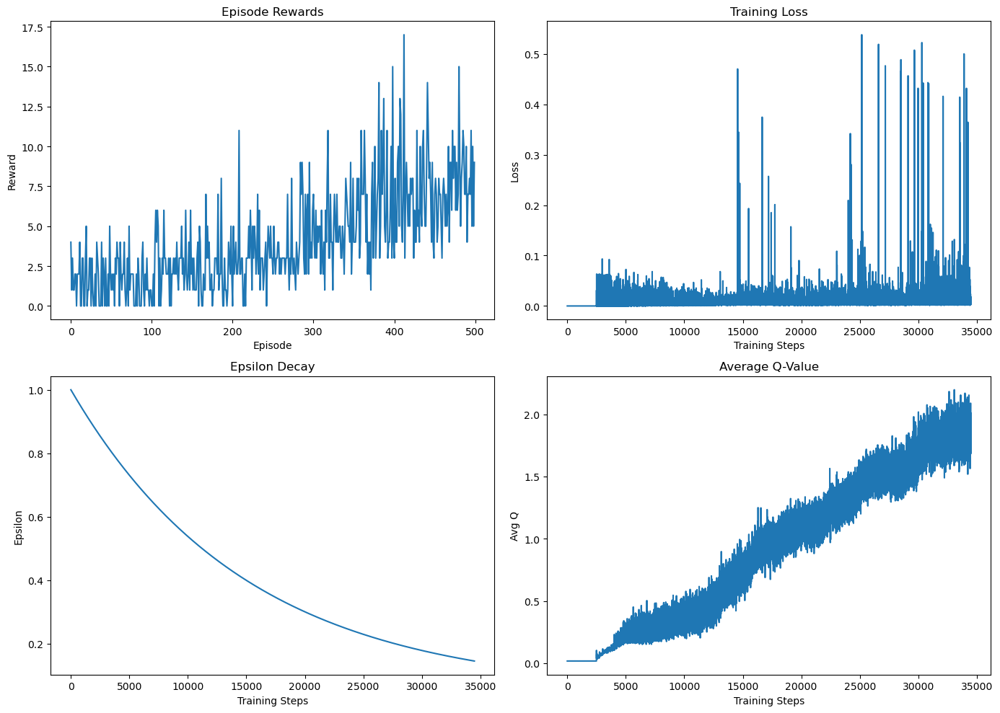

Обучал Pong и Breakout в течение 500 эпизодов
Несмотря на то, что целевые показатели достигнуты не были, хорошо видно динамику обучения, на основании которой можно выбрать лучшие модели для обучения в течение 5000 эпизодов (Ноутбук будет приложен после завершения обучения)

## Pong: анализ по графикам

### Episode Rewards:
В первой версии: после 250 эпизода начинается плавный рост награды от -21 до -17, что говорит о начале обучения. Во второй — награда остаётся на уровне -20, что может свидетельствовать о слишком медленном уменьшении ε, из-за чего агент слишком долго исследует.

### Training Loss:
В первой версии — хорошая динамика: снижение с 0.14 до 0.06. Во второй — стабильное значение 0.1 без изменений, что указывает на отсутствие значимого обучения.

### Epsilon Decay:
В первой версии ε снижается быстро и достигает плато, давая агенту возможность начать использовать выученную стратегию. Во второй — очень медленный спад ε, что, вероятно, мешает агенту эффективно использовать получнные знания.

### Average Q-value:
В первой версии — типичная динамика: сначала снижение (агент не уверен), затем рост, по мере стабилизации стратегии. Во второй — постоянное снижение, что сигнализирует о том, что агент не уверен в своих действиях и не получает стабильного положительного подкрепления.

### Вывод:
первая версия для Pong работает хорошо, вторая не обучается.

## Breakout: анализ по графикам

### Episode Rewards:
В обеих версиях агент показывает положительную динамику. Во второй — рост до 7.5 к концу обучения. Это говорит о том, что обучение идёт успешно.

### Training Loss:
В первой версии — преимущественно низкие значения, с редкими выбросами, с самого начала. Во второй — появляются частые выбросы ближе к концу обучения, что может быть связано с началом эксплуатации и более агрессивным обучением.

### Epsilon Decay:
В обеих версиях — пологий спад ε. Во второй — немного медленнее, но, на практике, мы видим, что для этой игры этого хватает для устойчивого роста.

### Average Q-value:
В обеих версиях — линейный рост, особенно хорошо выражен во второй. Это признак того, что агенту всё более понятно, какие действия хорошие, и он уверен в выборе.

### Вывод:
обе версии работают, но вторая показывает более стабильное улучшение.